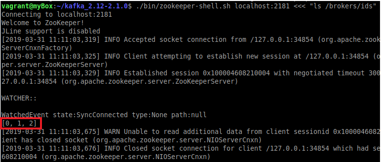

# 1. Project Description - Kafka Architecture
Our company is in charge of a fleet - or rather a swarm - of drones patrolling France. Their mission is to detect moskitoes and kill them with the use of an embeded laser.

Our swarm is composed of a thousand of drones. We decided to use Kafka in order to store communication between drones and our control center in charge of flight regulation and analitics analysis.

The drones will communicate their state and performance over time to the control center through 2 topics partitionned over 3 brokers. 
The first topic is the state topic. It will store the drone state related data such as :
 - drone id
 - drone speed
 - drone location (longitude, latitude, height)
 - drone battery

The second topic is the performance topic. It will store the drone performances related data such as:
 - drone id
 - drone quantity of ammo
 - drone moskitoe kill counter
 - drone efficacity (rate representing drone productivity per day)

# 2. Project Structure
Our project structure is composed of model classes, serializer and deserializer classes, producer and consumer classes.
The model instances are given as parameter to the producer instance that use the serializer to format the data and send them to the topics.
Then when we wish to consume data, the consumer instance will use the deserializer instance to retrieve and transform data from topics into model classes. We can then perform statistics operations on those data.

# 3. Set up your environment to test our program

As said before, we use 2 topics partitioned over 3 brokers. In order to test our program, you need to set up this configuration on your machine. Please follow this steps by steps explanation bellow:

##### 3.1. First you need to delete any previous data generated by another Kafka use
Delete those folders if they exist:

- /tmp/zookeeper 
- /tmp/logs 
- /tmp/kafka-logs

For the rest of the tutorial, go into your ***kafka folder***.

##### 3.2. Then we need to create a configuration file for each of our brokers:
    $ ./config/server-0.properties
    $ ./config/server-1.properties
    $ ./config/server-2.properties

For convenience, we provided you those files in our project file structure in /config folder. But feel free to generate them by yourself.

We can now start zookeeper server and then create our three brokers based on the three files we created:

##### 3.3. Starting Zookeeper

     $ ./bin/zookeeper-server-start.sh config/zookeeper.properties &

##### 3.4. Creating the three brokers
    $ ./bin/kafka-server-start.sh config/server-0.properties &
    $ ./bin/kafka-server-start.sh config/server-1.properties &
    $ ./bin/kafka-server-start.sh config/server-2.properties &

You can check that the 3 brokers are effectively running by running the following command:

    $ ./bin/zookeeper-shell.sh localhost:2181 <<< "ls /brokers/ids"

It should display something like this :

##### 3.5. Now as a last step you need to create our 2 topics:

    $ ./bin/kafka-topics.sh --create --zookeeper localhost:2181 --replication-factor 1 --partitions 3 --topic state_topic
    $ ./bin/kafka-topics.sh --create --zookeeper localhost:2181 --replication-factor 1 --partitions 3 --topic perform_topic

 
